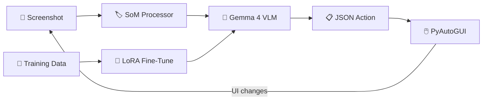

# VLM UI Agent — End-to-End Guide

Build a fine-tuned vision-language model that observes your screen, understands UI elements, and executes actions (click, drag, type) to complete tasks.

## Architecture Overview



**Loop**: Capture screen → overlay numbered boxes on UI elements → VLM picks an action → execute it → repeat.

**Training**: Labeled (screenshot, action) pairs → LoRA fine-tune → sharper action predictions.

---

## Prerequisites

| Requirement | Details |
|---|---|
| **Hardware** | Apple Silicon Mac (M1/M2/M3/M4), 16+ GB RAM |
| **Python** | 3.11+ |
| **macOS Permissions** | Terminal needs Accessibility access for PyAutoGUI |
| **Disk** | ~12 GB for Gemma 4 E2B weights |

---

## Step 1: Environment Setup

```bash
# Clone and enter the project
cd vlm-action-core

# Create a virtual environment
python3 -m venv .venv
source .venv/bin/activate

# Install core dependencies
pip install -r requirements.txt

# Install LoRA fine-tuning dependencies (needed for Step 5+)
pip install peft trl
```

> [!IMPORTANT]
> **macOS Accessibility**: Go to **System Settings → Privacy & Security → Accessibility** and add your Terminal app. Without this, PyAutoGUI cannot control mouse/keyboard.

---

## Step 2: Test the Base Model

Verify that Gemma 4 loads and can describe images on your Mac.

```bash
python ask_image.py --image data/images/todo.png -q "What do you see?"
```

**What happens:**
1. Downloads `google/gemma-4-e2b-it` from HuggingFace (~10 GB, first run only)
2. Loads to CPU, moves to MPS (Metal GPU)
3. Processes the image and generates a text response
4. Prints the answer + tokens/second benchmark

**Expected**: A description of the image and a speed report (~8-15 tok/s on M3 Pro).

**Interactive mode** — keep asking questions about the same image:
```bash
python ask_image.py --image data/images/todo.png --interactive
```

---

## Step 3: Test the Agent Loop (Dry Run)

Run the full observe → think → act pipeline **without executing real actions**.

```bash
python main.py --task "click the Finder icon in the dock" --dry-run --max-steps 2
```

**What happens at each step:**

| Stage | Module | What it does |
|---|---|---|
| 📸 Capture | `src/observer/capture.py` | Takes a screenshot via `mss` |
| 🏷️ Annotate | `src/observer/som_processor.py` | Detects UI regions via OpenCV, overlays red numbered boxes |
| 🧠 Think | `src/engine/llm_client.py` | Sends annotated screenshot + task to Gemma 4 |
| 📋 Parse | `src/executor/parser.py` | Extracts and validates the JSON action |
| 🖱️ Act | `src/executor/actions.py` | In `--dry-run`: prints action. Live: executes via PyAutoGUI |

The `--dry-run` flag lets you verify the pipeline works without touching your UI.

---

## Step 4: Collect & Label Training Data

The base model can do basic actions, but fine-tuning makes it far more accurate for your specific apps. You need labeled examples: **screenshot + correct action**.

### Option A: Interactive Labeling (Recommended to Start)

```bash
python annotate_actions.py --folder data/images --task "manage my todo list"
```

**What happens:**
1. Opens each image in your `data/images/` folder
2. Runs SoM detection → shows the annotated image with numbered boxes
3. Prints the element map (which box = which ID + coordinates)
4. Asks you to label the correct action:

```
  action type > click
  element_id (number from SoM overlay) > 3
  reason (why this action?) > click the checkbox to mark item as done
  ✓ Recorded: click
```

5. Saves everything to `data/training/annotations.jsonl`

### Option B: Single Image, Direct Label

```bash
python annotate_actions.py \
    --image data/images/todo.png \
    --task "check off first item" \
    --action '{"action":"click","element_id":1,"reason":"click the first checkbox"}'
```

### Option C: Batch File

Create a JSON file following the template in example_batch.json:

```bash
python annotate_actions.py --batch data/training/example_batch.json
```

### Collecting More Screenshots

Take screenshots of the app you want to automate:
```bash
python -c "from src.observer.capture import capture_screenshot; capture_screenshot(save=True)"
```
Screenshots save to `data/raw/`. Copy interesting ones to `data/images/` for labeling.

> [!TIP]
> **How many examples?**  Start with **20-30 examples** covering different UI states and action types. 50+ examples will give significantly better results. Include variety — different apps, window positions, light/dark mode.

---

## Step 5: Prepare the SFT Dataset

Convert your annotations into the format needed for training:

```bash
python train_agent.py prepare --annotations data/training/annotations.jsonl
```

**What it produces**: `data/training/sft_dataset.jsonl` — each line is a conversation:

```json
{
  "image": "data/training/som_todo.png",
  "messages": [
    {"role": "system", "content": "You are a UI navigation agent..."},
    {"role": "user", "content": "Task: check off first item\nStep: 1\n..."},
    {"role": "assistant", "content": "{\"action\":\"click\",\"element_id\":1,...}"}
  ]
}
```

The model trains to predict the **assistant message** (action JSON) given the image + user prompt.

---

## Step 6: Fine-Tune with LoRA

```bash
python train_agent.py train \
    --data data/training/sft_dataset.jsonl \
    --epochs 3 \
    --batch-size 1 \
    --lr 2e-4 \
    --lora-r 16
```

**What happens:**
1. Loads Gemma 4 E2B in float16 → CPU → MPS
2. Attaches LoRA adapters to attention layers (`q_proj`, `v_proj`, `k_proj`, `o_proj`)
3. Only trains ~0.1% of parameters (LoRA weights), base model stays frozen
4. Loss is masked so the model only learns to predict the **action JSON**, not the user prompt
5. Saves the LoRA adapter to `models/ui_agent_lora/`

| Parameter | Default | What it controls |
|---|---|---|
| `--epochs` | 3 | Passes over the data. More = better fit, risk of overfitting |
| `--lr` | 2e-4 | Learning rate. Lower = safer, slower |
| `--lora-r` | 16 | LoRA rank. Higher = more capacity, more memory |
| `--batch-size` | 1 | Keep at 1 for 18 GB RAM |

> [!NOTE]
> **Training time estimate**: With 30 examples, 3 epochs, batch size 1 on M3 Pro: **~15-30 minutes**. The LoRA adapter will be ~50-100 MB (vs 10 GB for the full model).

---

## Step 7: Evaluate

Test how well the fine-tuned model predicts actions on your data:

```bash
python train_agent.py eval \
    --adapter models/ui_agent_lora \
    --test-data data/training/sft_dataset.jsonl
```

**Output**: Shows each test example with predicted vs expected action, plus overall accuracy:
```
  [✓] Example 1: expected={"action":"click",...}
       predicted={"action":"click",...}
  [✗] Example 2: expected={"action":"type",...}
       predicted={"action":"click",...}

  Accuracy (action type match): 8/10 (80%)
```

> [!TIP]
> If accuracy is low, collect more diverse training examples and increase epochs.

---

## Step 8: Run the Live Agent

With the fine-tuned model, run the agent for real:

```bash
# Dry run first (always recommended)
python main.py --task "open Safari and search for weather" \
    --model models/ui_agent_lora --dry-run --max-steps 5

# Live execution
python main.py --task "open Safari and search for weather" \
    --model models/ui_agent_lora --max-steps 10
```

> [!CAUTION]
> The live agent controls your mouse and keyboard. Keep a hand near a screen corner — moving the mouse to any corner triggers PyAutoGUI's fail-safe and stops execution.

---

## Project File Reference

| File | Purpose |
|---|---|
| ask_image.py | Test VLM on images (Q&A, benchmarking) |
| main.py | Agent loop: observe → think → act |
| annotate_actions.py | Label screenshots with actions |
| train_agent.py | Prepare data, fine-tune, evaluate |
| collect_trajectory.py | Auto-record agent runs as training data |
| src/observer/ | Screenshot capture + SoM element detection |
| src/engine/ | VLM inference + prompt engineering |
| src/executor/ | Action parsing + PyAutoGUI execution |

---

## Improving Accuracy — Tips

1. **More data**: 50+ diverse examples across different UI states
2. **Variety**: Include click, type, drag, scroll examples — not just clicks
3. **Multiple apps**: Train on Finder, Safari, Notes, Terminal etc. for generalization
4. **SoM tuning**: If elements are missed, adjust thresholds in som_processor.py (`MIN_AREA`, `blockSize`)
5. **Iterative**: Run the agent → correct its mistakes → add corrections as training data → retrain
6. **Bigger model**: Switch to `google/gemma-4-e4b-it` for harder tasks (slower but smarter)
